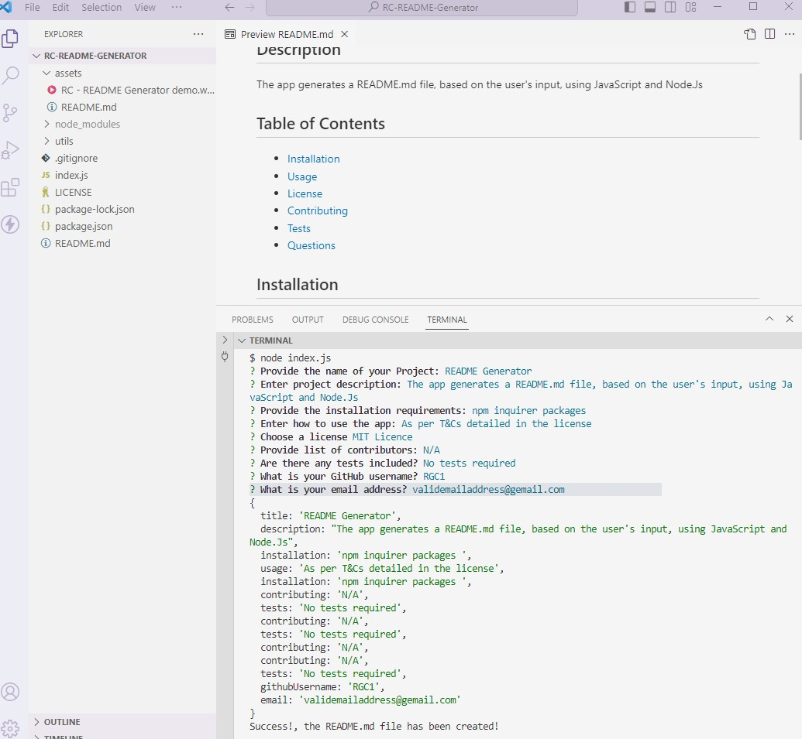

# RC-README-Generator

## Description

This application will allow a user to create a README.md document using only Javascript and Node.js.

## Installation

The app requires NPM inquirer packages

## Link

Link for demo: https://drive.google.com/file/d/1Ot13IT1H4-Kkk7lrSavMoOs9fkubwF04/view?pli=1

## Screenshot

## Resources

* Starter code provided by FE bootcamp
* Inquirer package: https://www.npmjs.com/package/inquirer
* Licenses: https://choosealicense.com/ and https://opensource.org/licenses/
* https://coding-boot-camp.github.io/full-stack/github/professional-readme-guide

## License

MIT License